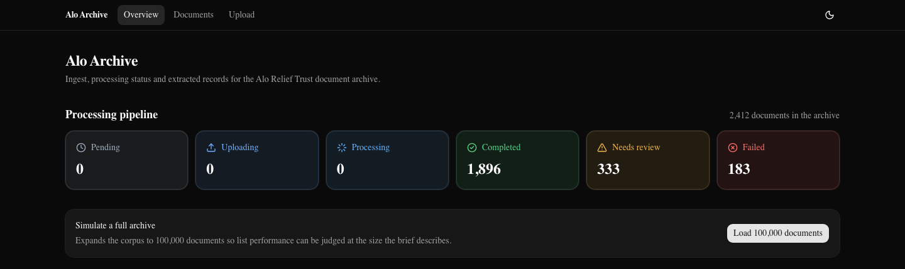
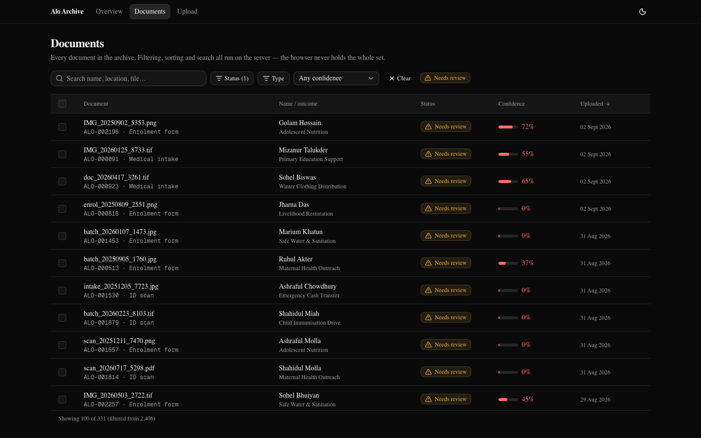
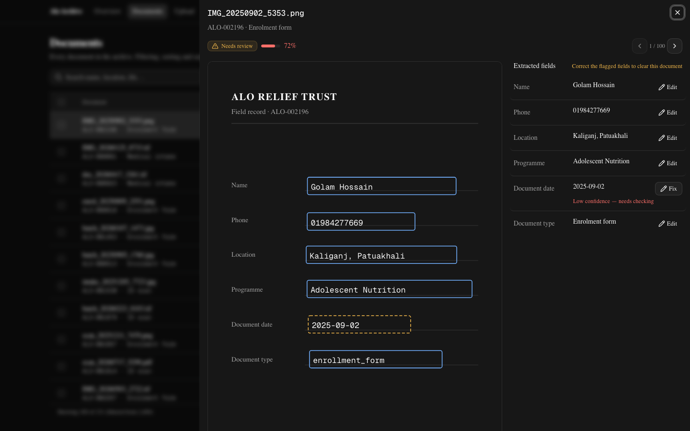
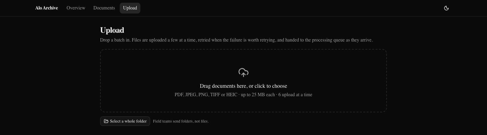

# Alo Archive

A frontend prototype for digitising the Alo Relief Trust document archive:
upload documents in bulk, watch them move through processing, and review the
records that came out uncertain.

> All nine features in scope are built and covered by tests. `ASSUMPTIONS.md`
> records what was assumed, what was deliberately left out, and why.

**Overview** — status at a glance, and the one-click path to judging
performance at the archive's real scale:



**Documents** — server-side filter/sort/search over a virtualised table;
this view is filtered to the 331 documents currently flagged for review:



**Review panel** — the page and the extracted fields side by side, linked by
the bounding box each value was actually read from; the flagged date field
is one click from being corrected in place:



**Upload** — drag-and-drop or a whole folder, with the accepted types and
limits stated up front rather than discovered via a rejection:



## Running it

```bash
npm install
npm run dev
```

That is the whole setup — no `.env` file to create, no database, no services
to start. Node 20.9+ (`.nvmrc` pins 22).

```bash
npm run verify   # lint, formatting, types, colour contrast, tests, production build
```

| Script | What it does |
| ------ | ------------ |
| `npm run dev` | Development server |
| `npm run build` / `npm start` | Production build and serve |
| `npm test` | Unit tests (Vitest) |
| `npm run lint` | ESLint, including the no-raw-colours rule |
| `npm run typecheck` | Route typegen, then `tsc --noEmit` |
| `npm run check:contrast` | Fails if any colour token drops below WCAG AA |
| `npm run e2e` | Playwright, against a real production build it starts itself |

## Seeing it at scale

The brief is about an archive of roughly 100,000 documents, and nobody
assessing this is going to drag 100,000 files onto a dropzone. **Load 100,000
documents** on the overview page expands the corpus in place — the index
builds in ~160 ms, and a filtered, sorted page request against the full
100,000 rows returns in ~30–90 ms of server time.

## How it is put together

```
src/
  app/
    api/            mock backend — route handlers only
    page.tsx        overview
  features/
    documents/      api/ (keys, queryOptions, mutations), components/, hooks/
  lib/
    api/            the one fetch wrapper + the typed error union
    domain/         Zod schemas; every type is inferred from them
  server/           the simulated archive: fixtures, index, simulation
```

State lives in three places, on purpose:

| Layer | Tool | Holds |
| ----- | ---- | ----- |
| Server state | TanStack Query | document list, detail, summary |
| URL state | nuqs | filters, sort, selected document |
| Client machine | Zustand | the upload queue |

Filters live in the URL so a view is shareable and survives a refresh. The
upload queue is a long-lived state machine rather than server state, so it
sits outside React Query and can be unit-tested without a component.

`src/lib/api/client.ts` is the only place that calls `fetch`; every response
is validated against a Zod schema, so a server change surfaces as one `parse`
error rather than `undefined` three components deep. Errors are a
discriminated `ApiError` (`network` / `aborted` / `http` / `parse`), and one
predicate, `isRetryable`, decides both whether TanStack Query retries and
whether the UI offers a retry button.

### Scale

- A flat index row per document holds only what filtering/sorting need; full
  records are materialised only for the ~100 rows a page actually returns.
- Pagination is **keyset**, not offset, so a row changing status mid-scroll
  cannot shift the window and make the virtualiser skip or repeat entries.
- The table is an ARIA grid, not a `<table>` — `aria-rowcount`/`aria-rowindex`
  report the real total even though only ~30 rows are ever in the DOM.
- Below 768px the same virtualiser renders cards instead of grid rows; the
  table never gets a horizontal scrollbar.

### Realtime without the flood

Processing progress arrives over SSE, carrying only `summary` (aggregate
counts) and `changed` (the ids that moved) — never a full document object per
change, which is fine at 200 documents and catastrophic at 100,000. The client
patches cached detail queries directly and throttles list invalidation to once
every 1.5 s. There is no background timer either: the simulation advances
lazily whenever the archive is read, and the SSE ticker lives and dies with
the connection.

### Failures are data, not exceptions

8% of documents failing is the normal, expected state of this system. A
failed document is a row with `status: 'failed'` and a retry affordance — it
never throws, never reaches an error boundary. Retryability is a property of
the error code (`OCR_TIMEOUT` can be retried, `PASSWORD_PROTECTED` never can),
not a flag, so the two cannot disagree.

### The upload queue

A pure state machine (`features/upload/lib/queue.ts`), no React and no
`fetch` in it — scheduling is the interesting part, and none of it needs a
rendered component to test. Nineteen unit tests cover it directly; `npm run
e2e` covers a real upload failing, retrying, backing off and recovering,
driven through a real browser against a production build.

- **Concurrency is capped at six** — measured, not assumed.
- **Retries back off exponentially, with jitter**, so six simultaneous
  failures don't retry in the same instant and reproduce the load that
  caused them.
- **A 4xx is not retried** — the file is the problem, not the connection.
- **Progress is weighted by bytes**, not file count; cancelled files leave
  the denominator so a stopped batch reads as finished, not stuck.
- **Nothing is refused silently** — type/size are checked client- and
  server-side, and whatever's turned away is reported with a per-reason
  breakdown and an itemised list (capped at 50 names).
- **The queue lives in a store, not a component**, so uploads continue while
  you navigate away; a header pill keeps the work visible.
- **A batch ends with a statement** — what was accepted, what failed, and
  what to do next — not a progress bar left at 100%.

### Uploads are chunked and resumable

Ingest is `POST /api/uploads/sessions` (opens a session) → `PUT
.../parts/:n` (each 4 MB chunk) → `POST .../complete` — the same shape a
presigned S3 multipart upload uses. The session id and resume token persist
to `localStorage`, keyed by `name:size:lastModified`. Re-selecting the same
file after an interruption resumes from the last part the server
acknowledged; a different file, or the same one past the session's one-hour
TTL, just opens a fresh session — there's no incorrect state reachable, only
a missed optimisation.

The interrupted-batch banner names the files still pending (up to five, with
an "and N more" tail) so the operator knows what to re-select, read straight
from the queue in the same effect that writes the `beforeunload` breadcrumb.

### Bulk actions carry the query, not the ids

Selection is a mode plus a small exception set, so "select all 100,000,
untick three" is three strings. "Retry all failed" posts the filter and the
exceptions — 113 bytes, the same at 182 rows or 100,000 — and the server
resolves the set where it already lives, replying with counts broken down by
error code.

### Column widths are a preference, not a layout accident

Four of five columns are drag-resizable (`Document` stays flexible and
absorbs the rest). Dragging reports incremental deltas, persisted to
`localStorage` by `useColumnWidths`. `ArrowLeft`/`ArrowRight` on a focused
handle steps it for anyone who can't drag; `Escape` mid-drag reverts; a
double-click resets just that column.

### Saved views are a name for a URL

Filters already live in the URL, so "save a view" is just a name next to a
`DocumentFilters` object in `localStorage` — applying it calls the same
`setFilters` a filter click makes. No server-side record, since there's no
account for one to belong to.

### The review loop

The panel is a split screen: a page on one side, the extracted fields on the
other, so comparing the machine's reading against the paper is possible
rather than inviting a rubber stamp. The page is a stand-in (scans aren't
kept) but drawn from the server's real per-field bounding boxes, so the
highlights can't drift from the data. Hovering or focusing a field lights up
its box; a missing field has no box at all.

Corrections are pinned to full confidence, marked `corrected`, and lift a
document out of the review queue on their own if they clear the threshold.
The panel steps document to document rather than bouncing back to the list
between each one.

### Colour

No component names a colour — semantic tokens only, enforced by an ESLint
rule, with a contrast script that parses `globals.css` and fails the build
below WCAG AA in either theme. Full reasoning in `ASSUMPTIONS.md`.

### Lighthouse: 100 / 100 / 100 / 100, desktop, all three routes

```bash
npm run build && npm start   # production build — `npm run dev` scores lower
                              # and isn't representative
npx lighthouse http://localhost:3000 --preset=desktop
```

`--preset=desktop` matches this app's actual persona (an operations
coordinator on a desktop browser); the default mobile-simulated preset holds
low-to-mid 90s on Performance purely from simulated network latency (TTFB is
~2 ms). Auditing via Chrome DevTools instead of the CLI needs an **Incognito
window** — a regular profile's extensions and cached data can inflate CLS,
and Lighthouse says so in its own report when it happens.

`ASSUMPTIONS.md` has the full investigation, including a real WCAG failure
the static token check couldn't see and a real layout shift, both found and
fixed — and a separate keyboard/accessibility-tree pass, since a 100
accessibility score is `axe-core`'s automated rules passing, not the same
claim as "works for someone tabbing through it."

## Assumptions and trade-offs

In [`ASSUMPTIONS.md`](./ASSUMPTIONS.md) — what was assumed, what was
deliberately left out, and why. Sixteen numbered decisions in total; the ones
most likely to surprise someone testing the app rather than reading the
source:

- [Upload is capped at 25 MB / 64 bytes / five file types](./ASSUMPTIONS.md#assumption-13) —
  enforced, not cosmetic, and not `.env`-configurable like the simulated
  pipeline is.
- [Confidence reads as high/medium/low at 90% and 75%, and 75% is also the
  `needs_review` cutoff](./ASSUMPTIONS.md#assumption-14).
- ["Over 50 pages" in the failure catalogue is a label on a randomly-simulated
  error, not an enforced check](./ASSUMPTIONS.md#assumption-15).
- [Search debounces 300 ms; query results are treated as fresh for
  30 s](./ASSUMPTIONS.md#assumption-16) — ordinary client defaults, not
  product decisions.

## What I would do with more time

- Move file enumeration and hashing off the main thread into a Web Worker.
